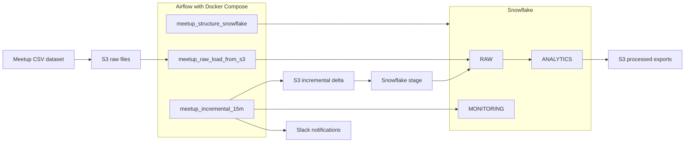

# Meetup Data Pipeline

Pipeline de datos usando **Airflow, Snowflake, AWS S3 y Slack**.

## Objetivo

Cargar un dataset de Meetup en Snowflake, automatizar su procesamiento con Airflow, generar tablas analíticas y exportar resultados a S3.

## Architecture Diagram

This project orchestrates a Meetup data pipeline with Airflow, Snowflake, AWS S3, and Slack.

## Tecnologías usadas

- Apache Airflow
- Snowflake
- AWS S3
- Slack
- Docker Compose
- Python

## Estructura general

- **DAG 1:** crea la estructura base en Snowflake
- **DAG 2:** carga inicial de los archivos CSV a tablas RAW
- **DAG 3:** ejecuta un proceso incremental cada 15 minutos sobre eventos, actualiza datos con `MERGE`, reconstruye tablas analíticas y exporta resultados a S3

## Flujo del proyecto

1. Los archivos fuente se almacenan en S3.
2. Airflow ejecuta la carga inicial hacia Snowflake.
3. Se crean tablas RAW con la información base.
4. Se generan tablas analíticas para procesamiento y análisis.
5. Cada 15 minutos se ejecuta un DAG incremental:
   - genera nuevos datos de eventos
   - carga un delta a Snowflake
   - actualiza la tabla principal con `MERGE`
   - reconstruye tablas analíticas
   - exporta resultados a S3
   - envía notificación a Slack

## Tablas principales

### RAW
Tablas base cargadas desde los archivos CSV del dataset.

Dataset fuente:
https://www.kaggle.com/megelon/meetup

### ANALYTICS
Tablas procesadas para análisis, por ejemplo:
- `EVENTS_ENRICHED`
- `AGG_EVENTS_BY_CITY`
- `AGG_GROUPS_BY_CATEGORY`
- `AGG_GROUPS_BY_TOPIC`
- `AGG_EVENTS_BY_GROUP`

## Ejecución

El proyecto se ejecuta con Airflow usando Docker Compose.

Primero se levanta el entorno de Airflow, luego se ejecutan los DAGs en este orden:

1. `meetup_structure`
2. `meetup_load_raw`
3. `meetup_incremental_15m`

## Notas

- Se implementó integración con Slack para notificaciones de éxito o fallo.
- Se implementó exportación de tablas procesadas desde Snowflake hacia S3.
- El archivo `members.csv` fue identificado como un caso especial por su tamaño y puede requerir una estrategia adicional de manejo para producción.

## Autor

Cristian Rojas