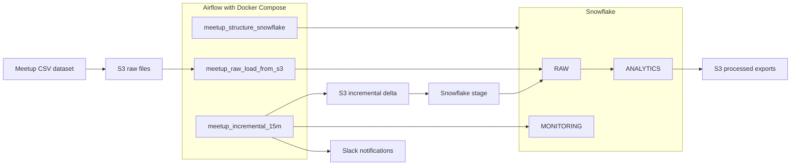

# Meetup Data Pipeline

Data engineering project built with **Apache Airflow**, **Snowflake**, **AWS S3**, **Python**, **Docker Compose**, and **Slack notifications**.

The goal of this project is to demonstrate how a data pipeline can be designed with a clear structure, incremental processing, data quality checks, auditability, and lightweight engineering practices such as testing and CI.

## What This Project Demonstrates

- Batch ingestion from AWS S3 into Snowflake
- CSV normalization before loading raw data
- Airflow orchestration using multiple DAGs
- Snowflake schemas for raw data, analytics, and monitoring
- Incremental event processing with a staging table and `MERGE`
- Data quality checks before merging incremental data
- Audit records for pipeline execution events
- Analytical tables for downstream reporting
- Processed exports from Snowflake back to S3
- Slack notifications for pipeline execution status
- Modular Python code separated from Airflow DAG definitions
- Lightweight unit testing with `pytest`
- Code quality validation with `ruff`
- GitHub Actions workflow for automated CI checks


## Architecture Diagram

This project orchestrates a Meetup data pipeline with Airflow, Snowflake, AWS S3, and Slack.



## Repository Structure

```text
pipeline-snowflake/
├── dags/
│   ├── meetup_structure_snowflake.py
│   ├── meetup_raw_load_from_s3.py
│   └── meetup_incremental_15m.py
│
├── src/
│   └── meetup_pipeline/
│       ├── config/
│       ├── ingestion/
│       ├── monitoring/
│       └── quality/
│
├── sql/
│   └── snowflake/
│       ├── ddl/
│       ├── dml/
│       ├── marts/
│       └── exports/
│
├── tests/
│   └── unit/
│
├── .github/
│   └── workflows/
│       └── ci.yml
│
├── docker-compose.yaml
├── pytest.ini
├── requirements-dev.txt
├── ruff.toml
└── README.md
```

The project separates Airflow orchestration from reusable Python logic and Snowflake SQL assets.

- `dags/`: Airflow DAG definitions and task orchestration
- `src/meetup_pipeline/`: reusable Python logic for ingestion, configuration, monitoring, and quality checks
- `sql/snowflake/`: Snowflake SQL organized by responsibility
- `tests/`: unit tests for reusable pipeline components
- `.github/workflows/`: CI workflow for linting and tests


## Airflow DAGs

### 1. `meetup_structure`

Creates the foundational Snowflake objects required by the pipeline:

- databases and schemas
- raw tables
- monitoring tables
- file formats
- stages
- storage integration objects

### 2. `meetup_load_raw`

Performs the initial load of the Meetup CSV dataset into Snowflake.

Main responsibilities:

- read source CSV files from S3
- normalize CSV files before loading
- upload normalized files to S3
- load raw tables in Snowflake
- build the initial analytical layer
- record audit information

### 3. `meetup_incremental_15m`

Simulates an incremental event-processing workflow that runs every 15 minutes.

Main responsibilities:

- generate an incremental event delta
- upload the delta file to S3
- load incremental data into a Snowflake staging table
- run data quality checks
- merge valid records into `RAW.EVENTS`
- rebuild analytical tables
- export processed outputs to S3
- send Slack notifications

## Snowflake Layering

### RAW

Stores the source-level tables loaded from the Meetup CSV dataset.

Examples:

- `RAW.EVENTS`
- `RAW.GROUPS`
- `RAW.VENUES`
- `RAW.CATEGORIES`
- `RAW.TOPICS`

### MONITORING

Stores pipeline execution metadata and data quality results.

This layer supports basic auditability and troubleshooting.

### ANALYTICS

Stores processed analytical tables used for reporting and downstream analysis.

Examples:

- `ANALYTICS.EVENTS_ENRICHED`
- `ANALYTICS.AGG_EVENTS_BY_CITY`
- `ANALYTICS.AGG_GROUPS_BY_CATEGORY`
- `ANALYTICS.AGG_GROUPS_BY_TOPIC`
- `ANALYTICS.AGG_EVENTS_BY_GROUP`

## Data Quality Checks

The incremental pipeline validates staged event data before merging it into the main raw events table.

Current checks include:

- staged data is not empty
- `event_id` is not null
- duplicate event identifiers are detected
- invalid event statuses are detected
- RSVP limits are not negative
- expected generated rows are compared against loaded rows

## Current Limitations

This project intentionally keeps some areas simplified:

- incremental event data is simulated for demonstration purposes
- the analytical layer is currently rebuilt rather than modeled incrementally
- the project runs locally with Docker Compose instead of a deployed Airflow environment
- CI validates Python code and unit tests, but does not run against real AWS or Snowflake services
- infrastructure is not fully provisioned with Terraform
- `members.csv` was identified as a special case due to its size and may require a dedicated ingestion strategy

These limitations are intentional for the current portfolio scope and represent clear areas for future improvement.


## Tech Stack

- Apache Airflow
- Snowflake
- AWS S3
- Python
- Docker Compose
- Slack Webhook
- pytest
- Ruff
- GitHub Actions


## Dataset

Source dataset:  
https://www.kaggle.com/megelon/meetup

## Author

Cristian Rojas