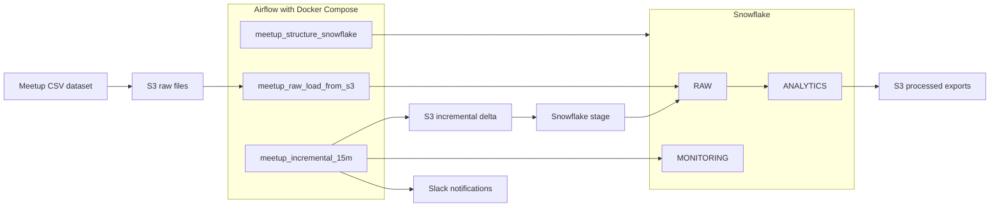

# Meetup Data Pipeline

A data pipeline project built with **Airflow, Snowflake, AWS S3, and Slack**.

## Objective

Load a Meetup dataset into Snowflake, automate its processing with Airflow, build analytical tables, and export results to S3.

## Architecture Diagram

This project orchestrates a Meetup data pipeline with Airflow, Snowflake, AWS S3, and Slack.

## Technologies Used

- Apache Airflow
- Snowflake
- AWS S3
- Slack
- Docker Compose
- Python

## High-Level Structure

- **DAG 1:** creates the base structure in Snowflake
- **DAG 2:** performs the initial load of CSV files into RAW tables
- **DAG 3:** runs an incremental process every 15 minutes for events, updates data with `MERGE`, rebuilds analytical tables, and exports results to S3

## Project Flow

1. Source files are stored in S3.
2. Airflow runs the initial load into Snowflake.
3. RAW tables are created with the base dataset.
4. Analytical tables are built for downstream processing and analysis.
5. Every 15 minutes, an incremental DAG runs and:
   - generates new event data
   - loads a delta into Snowflake
   - updates the main table with `MERGE`
   - rebuilds analytical tables
   - exports results to S3
   - sends a Slack notification

## Snowflake Schemas

### RAW
Base tables loaded from the source CSV files.

Source dataset:  
https://www.kaggle.com/megelon/meetup

### MONITORING

Stores data quality check results generated during pipeline execution.

### ANALYTICS
Processed tables used for analysis, for example:
- `EVENTS_ENRICHED`
- `AGG_EVENTS_BY_CITY`
- `AGG_GROUPS_BY_CATEGORY`
- `AGG_GROUPS_BY_TOPIC`
- `AGG_EVENTS_BY_GROUP`

## Execution

The project runs with Airflow using Docker Compose.

After starting the Airflow environment, the DAGs should be executed in the following order:

1. `meetup_structure`
2. `meetup_load_raw`
3. `meetup_incremental_15m`

## Notes

- Slack integration was implemented for success and failure notifications.
- Processed tables are exported from Snowflake to S3.
- The `members.csv` file was identified as a special case due to its size and may require an additional strategy for production-scale handling.

## Author

Cristian Rojas